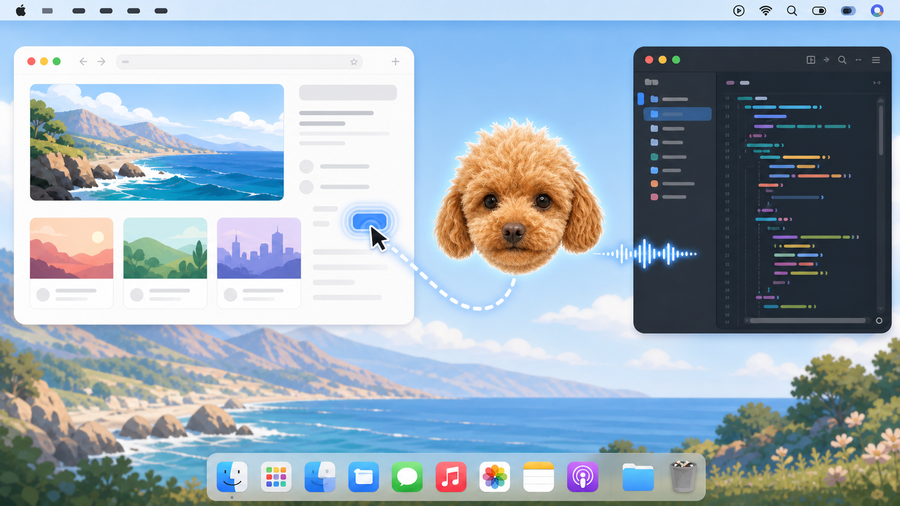

# 壮壮 · Matilda

> 一只住在 Mac 菜单栏里、每天跟着鼠标陪伴我的语音伙伴。



## 为什么是壮壮

壮壮是我已经去世的小狗。

我希望它还能以另一种方式每天陪着我：平时安静地跟在鼠标旁边；当我看不懂一个页面、找不到某个按钮，或者只是想聊聊时，我可以直接开口问它。它会结合眼前的屏幕回答，也会跑到相关位置旁边，告诉我应该看哪里。

这个项目最初基于 [farzaa/clicky](https://github.com/farzaa/clicky)，后来逐步换掉了模型、语音和服务，也重新设计了形象、动画、面板和交互。现在它是我的定制版本：英文产品名是 **Matilda**，显示在应用和菜单栏里的名字是 **壮壮**。

## 怎么和它相处

1. 启动壮壮，它会留在 Mac 顶部菜单栏，并用头像跟随鼠标；
2. 按住 `Control + Option`，直接说出你对当前页面的疑问；
3. 松开按键，壮壮会看着当前屏幕回答；
4. 如果答案涉及一个可见的按钮、图标、文件或界面区域，它会移动过去，并用脉冲圈标出位置；
5. 没听清时，打开菜单栏面板查看最近对话，也可以复制回答中的文字。

例如可以问：

- “这是什么页面？”
- “这个按钮为什么不能用？”
- “微信图标在哪里？”
- “我应该点哪个？”
- “把当前画面里的文字提取出来。”

## 现在能做到什么

- **陪伴**：壮壮头像跟随鼠标，支持眨眼、倾听、思考和到达目标后的“汪，汪汪”状态；
- **看懂屏幕**：结合当前截图解释页面、软件、按钮和可见内容；
- **语音交流**：按住快捷键说话，松开后获得语音回答；
- **视觉指引**：在需要寻找可见目标时移动到附近，并显示可调节的目标圈；
- **回看与复制**：菜单栏面板保留最近十轮对话；
- **调整回答**：可以选择简短、默认或详细回复；
- **调整声音**：可以搜索和试听 MiniMax 音色，并设置音量、语速和音调；
- **调整外观**：可以设置头像大小、跟随距离、快中慢速度、泛光、自动隐藏和指向标记；
- **多显示器使用**：会识别鼠标所在屏幕，并在对应屏幕显示壮壮和目标位置。

## 目前的边界

壮壮现在主要负责三件事：回答问题、理解当前屏幕、提供视觉位置指引。

它不会替你点击、输入、执行脚本或自动操作应用。目标坐标由视觉模型根据截图判断，适合帮助你找到大致位置，但还不能保证每次都像系统原生控件一样精确。项目目前也没有内置互联网搜索，因此涉及刚刚发生的新闻或最新资料时，回答可能不完整。

## 从 Clicky 到 Matilda

本项目保留了 Clicky 的菜单栏助手和屏幕指引想法，但当前版本已经完成这些主要改造：

- 用 MiniMax-M3 负责屏幕理解和问答；
- 用腾讯云实时 ASR 识别语音，并保留 Apple Speech 作为本地备用；
- 用 MiniMax TTS 生成语音，支持边生成边播放、音色搜索和试听；
- 支持本地 Node 代理，不注册 Cloudflare 也可以运行；
- 加入最近对话、复制、回答长度、音色和外观设置；
- 将蓝色三角形改造成以壮壮为原型的头像、动画、菜单栏图标和应用图标；
- 将鼠标跟随和自动隐藏改成按需运行，避免壮壮空闲时持续占用资源；
- 加强连续提问、语音取消、目标坐标和错误回退的稳定性；
- 移除原项目的遥测、发布脚本和当前版本不再使用的服务。

本地 `main` 相对上一版 GitHub 主分支的逐项整理见 [main 分支改动说明](docs/MAIN_CHANGES.md)。

## 运行前准备

需要：

- macOS 14.2 或更高版本；
- Xcode；
- Node.js 22 或更高版本；
- MiniMax API Key；
- 腾讯云 ASR 的 `AppID`、`SecretId` 和 `SecretKey`。

### 1. 启动本地代理

API Key 不写进 App，而是放在本地代理的配置文件中：

```bash
cd worker
npm install
cp .dev.vars.example .dev.vars
```

编辑 `worker/.dev.vars`：

```text
MINIMAX_API_KEY=你的_MiniMax_Key
TENCENT_ASR_APP_ID=你的腾讯云_AppID
TENCENT_ASR_SECRET_ID=你的腾讯云_SecretId
TENCENT_ASR_SECRET_KEY=你的腾讯云_SecretKey
```

然后启动：

```bash
npm run local
```

浏览器直接访问 `http://localhost:8787/` 显示 `Method not allowed` 是正常的。这个服务只接收 App 发出的指定请求。

### 2. 用 Xcode 启动壮壮

```bash
open leanring-buddy.xcodeproj
```

在 Xcode 中：

1. 选择 `leanring-buddy` scheme 和 `My Mac`；
2. 在 Signing & Capabilities 中选择自己的 Team；
3. 按 `Cmd + R` 构建并运行。

壮壮只出现在顶部菜单栏，不显示在 Dock。首次运行需要授权：

- 麦克风：听到你的问题；
- 辅助功能：识别全局 `Control + Option` 快捷键；
- 屏幕与系统录音：截取当前屏幕；
- 屏幕内容：通过系统 Screen Content picker 允许读取可分享的屏幕内容。

开发时尽量保持同一个签名和安装位置。不要在终端使用 `xcodebuild`，否则 macOS 可能把构建结果识别成另一个 App，并要求重新授权。

## 声音与外观

点击菜单栏中的壮壮头像，可以：

- 查看最近对话并复制回答；
- 调整回答长度；
- 打开语音设置，搜索和试听 MiniMax 音色；
- 设置语音音量、语速和音调；
- 打开外观设置，预览壮壮的倾听、思考和指向状态；
- 调整头像大小、鼠标距离、跟随速度、泛光、自动隐藏时间和目标圈样式。

## 可选：部署 Cloudflare Worker

本地 Node 代理已经可以完整运行。只有希望开机后不再手动启动本地服务时，才需要部署 Cloudflare Worker：

```bash
cd worker
npm install
npx wrangler secret put MINIMAX_API_KEY
npx wrangler secret put TENCENT_ASR_APP_ID
npx wrangler secret put TENCENT_ASR_SECRET_ID
npx wrangler secret put TENCENT_ASR_SECRET_KEY
npx wrangler deploy
```

部署后，把 `leanring-buddy/Info.plist` 中的 `WorkerBaseURL` 改成自己的 Worker 地址。

## 数据与隐私

- API Key 只保存在本地 `worker/.dev.vars` 或 Cloudflare secrets，不写入 App 包；
- 语音会发送给腾讯云 ASR；
- 问题、最近对话上下文和当前屏幕截图会经代理发送给 MiniMax；
- 项目不包含原作者的 PostHog 遥测；
- Release 版本不会把转写、模型回答或屏幕文字写入本地明文日志；
- `.gitignore` 已排除本地凭据、Node 依赖、构建产物、日志和生成音频。

## 给开发者

一次交流大致经过：

```text
按住 Control + Option
  → 腾讯云 ASR 将语音转成文字
  → ScreenCaptureKit 获取当前屏幕
  → 本地 Node 或 Cloudflare 代理转发给 MiniMax
  → MiniMax 回答按句进入流式 TTS
  → 需要指引时，壮壮移动到模型给出的屏幕位置
```

代理提供 `/chat`、`/tts`、`/tts-stream`、`/voices` 和 `/transcribe-url`。详细工程结构、测试约定和文件职责见 [AGENTS.md](AGENTS.md)。

Worker 检查：

```bash
cd worker
npm test
npm run typecheck
node --check local-server.mjs
```

Swift App 请通过 Xcode 界面构建和测试。当前单元测试覆盖坐标映射、指向策略、权限流程、流式分句、低资源动画和 TTS 取消。

## 上游与许可证

原始项目：[farzaa/clicky](https://github.com/farzaa/clicky)。感谢原作者公开 Clicky，并以 MIT License 允许继续学习和改造。

本仓库保留原项目版权声明并继续使用 [MIT License](LICENSE)。Matilda / 壮壮是基于个人记忆和使用需求形成的定制版本，不是 Anthropic、MiniMax 或腾讯云的官方项目。
